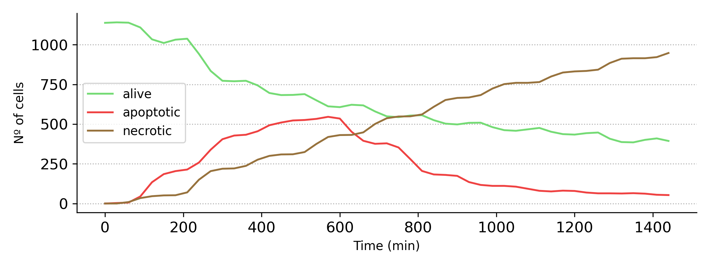
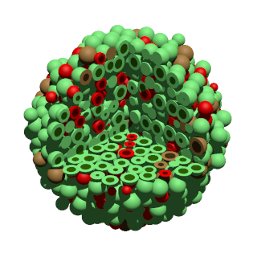

# Introduction
PhysiCell ToolKit (PCTK) is a tiny project that aims to develop a lightweight library and command-line general scripts to process and analyze agent-based simulation of multicellular systems produced by PhysiCell simulations ([http://physicell.org/](http://physicell.org/)) developed by Paul Macklin at MathCancer. Although there are already available tools for handling PhysiCell outputs [https://github.com/PhysiCell-Tools/python-loader](https://github.com/PhysiCell-Tools/python-loader), here we aim to gather together and organize different pieces of python code that have been anyhow, recurrently useful in the past, when dealing with PhysiCell and PhysiBoSS. Currently, the package implements a simple module ([multicellds.py](https://github.com/migp11/pctk/blob/master/modules/multicellds.py)) to parse and handle MultiCellDS XML file format and uses the schema defined there to parse and process \.mat files containing the cells and microenvironment time dependent output. On the top of this module we have developed a set of command-line tools for processing and creating basic plots, including time courses of the number of alive and dead cells (apoptotic, necrotic) as well as to generate POV files used as inputs for rendering nice 3D rendering of the multicellular models using [POV-Ray](http://www.povray.org/). PCTK can used both, as library and as stand-alone command line tool.

# Installation
PCTK is pure python code with few dependencies and only requieres the installation of some python modules. 
### On linux systems using virtualenv + pip
1 - create a new virtual environemnt, activate it and install the requirments:<br>

```virtualenv -p python3 venv```
<br><br>
2 - Activate the virtual enviroment:<br>

```source venv/bin/activate```
<br><br>
3 - Install pctk using pip:<br>

```pip install pctk```
<br><br>
PCTK can also be installed direclty from the git repository to get the latest version:<br>

```
pip install git+https://github.com/migp11/pctk/
```

The last step for generating 3D renders of cell from `.pov` files, it is done using Persistence of Vision Ray Tracer (POV-Ray). POV-Ray is a cross-platform ray-tracing standalone program that generates images from a text-based scene description. POV-Ray is open source and can be freely obtaind from: <br>
* [http://www.povray.org/download/](http://www.povray.org/download/)

# MultiCellDS class

MultiCellDS is the standard format for PhysiCel and thus PhysiBoSS outputs. For each simulation state save a time *t* different files in `.xml` and `.mat` formats are generated to store the informaion on the individual cells and the microenviroment. The module `multicellds` provides a simple python API for loading the different outputs into Pandas Dataframes; among other functionalities, `multicellds` allows to iterate over the sequences of outpus stored at each time setp of the simulations. Below there are a couple of code snippets:
<br>

```
from pctk import multicellds 

output_folder = "output/"

# Creating a MCDS reader
reader = multicellds.MultiCellDS(output_folder=output_folder)

# Counting the number of stored time steps
num_of_files = reader.cells_file_count()

# creating an iterator to load a cell DataFrame for each stored simulation time step
df_iterator = reader.cells_as_frames_iterator()

```

# Ready-to-run command line tool-kit
There are some ready-to-run scripts that can be used to summarize and visualize PhysiCell/PhysiBoSS simulation outputs. 
These commandlines tool allow generateing summary plots and `.csv` tables, as well as, 3D renders of the less at a given time point. Rendering requires an installes and running version of PovRay.
Subcommands include:
* `plot-time-course`
* `write-pov`


~~~~
usage: pctk [-h] {plot-time-course,povwriter} ...

PhysiCell Tool Kit for handling and processing Physicell outputs

positional arguments:
  {plot-time-course,povwriter}
                        sub-command help

optional arguments:
  -h, --help            show this help message and exit
~~~~

## Ploting time course:
The command plot-time-course plot number of cells vs time grouping cell by phase (alive, necrotic, apoptotic) <br>
The color mapping can be easily customized to represent other cell-agent variables (eg. color mutants or other cell states)
	

~~~~
usage: pctk plot-time-course [-h] [--format {physicell,physiboss}] [--figout FIG_FNAME] [--csvout CSV_FNAME] data_folder

Plot total cell grouped as Alive/Necrotic/Apoptotic vs Time

positional arguments:
  data_folder           folder were the data is stored

optional arguments:
  -h, --help            show this help message and exit
  --format {physicell,physiboss}
                        Format of the input data
  --figout FIG_FNAME    File name to save the plot
  --csvout CSV_FNAME    File name to store the summary table used for the plot
	
~~~~

#### Examples

`pctk povwriter output/ --figout physicell_time_plot.png`

<br>
**Figure 1. Time course of a simulation of cancer cell under a treatment.**
<br>


## Generations of pov files for 3D rendering: povwriter.py
This command is an almost "literal" translation from C++ to Python 3. The original C++ povrtiter is developed an mantined by Paul Macklin at MatchCancer and can be found in the following link:

<br>
[https://github.com/PhysiCell-Tools/PhysiCell-povwriter](https://github.com/PhysiCell-Tools/PhysiCell-povwriter)

<br>
While I've not found many difference at the level of performance, the main advantage of having python version of PhysiCell-povwriter is that is much easiert to extend and customize. Furthermore, handling command line arguments and parsing config files is also much easier in python. And the package can be easily extended to add new subcommandas and functionalitiyes. The subcommands `pctk povwriter` reads xml-based configuration for generating .pov files from PhysiCell output files.
The generated pov files can then be renderied usign the open source The Persistence of Vision Raytracer suite PovRay ([http://www.povray.org/](http://www.povray.org/)).


The command povwriter use an XML config file and PhyisiCell outputs to generate on POV files for each time step <br>

```
usage: pctk povwriter [-h] [--config CONFIG] [--idxs STRN_IDXS] [--format {physicell,physiboss}] [--render] [--width WIDTH] [--height HEIGHT] [--cpus CPUS] [--create-config CONFIG_FNAME]

optional arguments:
  -h, --help            show this help message and exit
  --config CONFIG       XML configuration file for creating pov files
  --idxs STRN_IDXS      String specifing the indexes of the output files. The supported options include: - slices: 1:10:1 - indexes: 1,2,5,10 - all (use glob)
  --format {physicell,physiboss}
                        Format of the input data
  --render              Render the .pov files into .png. Requires povray ({povray_link})
  --width WIDTH         Width for povray rendered image
  --height HEIGHT       Heigh for povray rendered image
  --cpus CPUS           Total cpus availabile to run in parallel using multiprocessing
  --create-config CONFIG_FNAME
                        Create a defaul config XML file for generating POV files
```
### Example: generating a new povwriter.xml configuration files

```
pctk povwriter --create-config povwriter.xml
Writing default POV-write config into povwriter.xml
```
#### Creating POV files using config/povwriter-settings.xml config
```
pctk povwriter --config config/povwriter-settings.xml
Found 3 clipping planes
Found 2 cell color definitions ... 
Start processing  4 cpus
Processing file  ./src/test/data/output/output00000000_cells_physicell.mat
Matrix size: 3963 x 28 
Creating file ./src/test/data/output/output00000000_cells_physicell.pov for output ... 
Writing 3963 cells ... 
Finished!
```

#### Creating POV files using config/povwriter-settings.xml slicing over physicell output files using 0:4:2
```
pctk povwriter --config src/test/data/config/povwriter-settings.xml --idxs 0:4:2
Found 3 clipping planes
Found 2 cell color definitions ... 
Start processing  4 cpus
Processing file  ./src/test/data/output/output00000000_cells_physicell.mat
Matrix size: 3963 x 28 
Creating file ./src/test/data/output/output00000000_cells_physicell.pov for output ... 
Writing 3963 cells ... 
Processing file  ./src/test/data/output/output00000002_cells_physicell.mat
Matrix size: 4137 x 28 
Creating file ./src/test/data/output/output00000002_cells_physicell.pov for output ... 
Writing 4137 cells ... 
Finished!
```

Any of these commands will generate one or many .pov files. If you have povray instaled in yout system you can try

```
pctk povwriter --config config/povwriter-settings.xml --idx 10 --render
```

If PovRay is installed, this command will generate a render using the provided `povwriter-settings.xm`

<br>
**Figure 2. Render of a 3D spheroid of cancer cells.**
<br>

```
povray -W720 -H680 -a [path to pov file]
```
to render the .pov file a generate an image. Parameters -H -W and -a correspond to Width, heigh and antilaizing, respectively.
